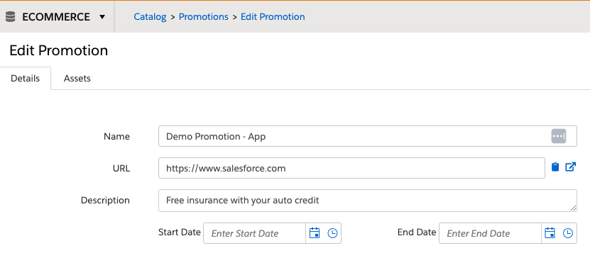

# MCP-Demo-App
Personalization Demo Mobile App

# MCP Mobile campaigns - Demo App

## About

This is an Android App to showcase the mobile capabilities of Salesforce Personalization, it helps to align expectations with our clients and to help technical teams in the implementation of the Mobile SDK.

The capabilities supported are:

* Mobile Data Campaigns
* In-App Message Campaigns
* Mobile Push Campaigns
* Server Side Campaigns
* Catalog events (ViewItem, Tags, Purchase)

## Prerequisites

* [Android Studio](https://developer.android.com/studio)
* Salesforce Personalization, a Learning Account is enough
* API token for Server Side Campaigns
* Google Firebase Cloud Messaging API (Legacy) for Push Notifications
* Some products in the Product Catalog for Catalog Events

## Project configuration

Some configuration is needed before testing the different campaigns, in Android Studio, browse to the file *strings.xml*


The configuration strings are categorized as illustrated in the following image


|Setting	|Description	|Value	|
|---	|---	|---	|
|app_name	|Application name, it's used internally in the app code	|demomcp1	|
|home_screen_logo	|Top screen logo (Cumulus logo)	|https://cumulus-fs.s3.amazonaws.com/images/cumulus-logo.png	|
|home_screen_title	|Main text	|Banner types (from MCP)	|
|experience_menu_item	|Button text	|Data Campaign - Experience	|
|promotion_menu_item	|Button text	|Data Campaign - Promotion (promoted)	|
|serverside_menu_item	|Button text	|Server Side Campaign	|
|catalog_menu_item	|Button text	|Catalog interactions	|
|experience_screen_title	|Screen title text	|Data Campaign - Experience	|
|experience_screen_action	|Action to be sent to MCP when this screen is accessed	|Experience screen	|
|experience_campaign_action	|Target to be used in data campaigns	|experienceTarget	|
|promotion_screen_title	|Screen title text	|Data Campaign - Promotion	|
|promotion_screen_action	|Action to be sent to MCP when this screen is accessed	|Promotion screen	|
|promotion_campaign_action	|Target to be used in data campaigns	|promotionTarget	|
|serverside_screen_title	|Screen title text	|Server Side Campaign	|
|serverside_screen_action	|Action to be sent to MCP when this screen is accessed	|Server Side screen	|
|serverside_app_name	|Application name to sent in Server Side Campaigns	|App - Demo	|
|serverside_campaign_action	|Action to be sent when requesting Server Side campaigns	|Get experience banner	|
|catalog_screen_title	|Screen title text	|Catalog interactions	|
|catalog_screen_action	|Action to be sent to MCP when this screen is accessed	|Catalog screen	|
|catalog_viewitem	|Button text	|View item (product)	|
|catalog_purchase	|Button text	|Purchase (conversion)	|
|catalog_tag	|Button text	|Tag	|
|catalog_viewItem_product_id	|Product Id to be used in catalog interactions	|WGJCFJOQEB	|
|catalog_viewItem_tag	|Value for the tag object (ItemClass)	|mobile1	|
|mcp_instance	|Personalization instance	|**** user your instance ****	|
|dataset	|Dataset name	|**** use your dataset name ****	|
|userId	|ID of the user to be sent as Identity (should be mapped to the correct identity attribute in the dataset's configuration)	|TEST002	|
|evergage_scheme	|Test schema, this value is dependant on the App's configuration in the dataset	|**** user your schema ****	|
|default_notification_channel_id	|Channel id for push notifications, no change is needed	|fcm_default_channel	|
|apiKeyId	|API token for Server Side Campaigns	|**** use your API token ****	|
|apiKeySecret	|API token for Server Side Campaigns	|**** use your API token ****	|
|mcpEndpoint	|Event API endpoint for Server Side Campaigns	|**** use your endpoint ****	|

## Mobile Data Campaign - Experience

This is how this banner looks in the App:


This banner requires a data campaign in Personalization, this is the configuration for that banner to work:


The campaign settings:


This campaign is triggered when the App sends the Action “Experience screen”


## Mobile Data Campaign - Promotion

This is how this banner looks in the App:


The data campaign that sends that content is configured as follows:


The campaign settings:


This campaign is triggered when the App sends the Action “Promotion screen”, the content (promotion) is served using Einstein Decisions, here is the Message Rules configuration:


This content is retrieved from a Promotion in Personalization:




## In-App Message Campaigns

This is how this campaign looks in the App:


The campaign that serves this In-App message is configured as follows:


The campaign settings:


This message is triggered when the App sends the action “Catalog screen”

## Push Notifications

The push notification looks like this:


For this capability to work, a Firebase Cloud Messaging Legacy API is required, the provided code uses the following API key:

>AAAAZjCmhOU:APA91bFPyXXdEzzhj24e0f-UABFAKKRzNRoDem8I9D1D-ztNcPVu3CCMhP8shy-sAl2hhwB1dZqLYCycQa_0eKdVSOjCtPKirREPLjNxlLLMebvkXyLl1z48Zkk2dolIq1QoLz04TWP9


The push notification campaign is configured as follows:


Campaign settings:


## Catalog events

You can send catalog events (using the configured values) by clicking the different buttons in this screen:


## Server Side Campaigns

This is how this banner looks in the App:


The campaign is configured as follows:


The server side template is shown here:

```
import { ItemReference } from "common";

export class CTABehavior {
  value: string;
  label: string;
}

function isCdnOrExternalImage(asset?: Asset) {
    return asset?.type === "CdnImage" || asset?.type === "ExternalImage";
}

export class AssetLookupOptions implements Lookup<string> {

    selectedPromo: ItemReference

    constructor(selectedPromo: ItemReference) {
        this.selectedPromo = selectedPromo;
    }

    lookup(context: GearLifecycleContext): string[] {
        if (!this.selectedPromo) return [];

        const fullPromo: Promotion = context.services.catalog.findItem("Promotion", this.selectedPromo.id) as Promotion;
        if (!fullPromo || !fullPromo.assets) return [];

        return fullPromo.assets.reduce((contentZones: string[], asset: Asset) => {
            if (isCdnOrExternalImage(asset) && asset?.contentZones) {
                asset.contentZones.forEach(zone => { if (!(zone in contentZones)) contentZones.push(zone) });
            }
            return contentZones;
        }, []);
    }
}

export class PromotionSearchOptions implements Search<string> {

    search(context: GearLifecycleContext, searchString: string): ItemReference[] {
        if (!searchString) return [];

        const promos: Promotion[] = context.services.catalog.findByName("Promotion", searchString) as Promotion[];
        return promos.reduce((allPromos, promo: Promotion) => {

            const promoItem = {
                itemType: "Promotion",
                id: promo.id,                
                label: promo.attributes["name"] != null ? promo.attributes["name"].value : promo.id,
            } as ItemReference;
            
            if((!promo.attributes.expiration || promo.attributes.expiration.value > Date.now()))
                if(!allPromos.some(e => e.label == promoItem.label))
                    allPromos.push(promoItem);

            return allPromos;
        }, []);
    }
}

export class ServerExperience implements CampaignTemplateComponent {

    @searchOptions(() => new PromotionSearchOptions())
    @title("Seleccione la promoción asociada")
    @subtitle("Seleccione la promoción que está asociada a la campaña que será desplegada en las zonas de contenido seleccionadas")
    selectedPromo: ItemReference;   

    @title("Seleccione el asset")
    @lookupOptions((self) => new AssetLookupOptions(self.selectedPromo))
    selectedAsset: string;

    @title("Color del banner")
    @subtitle("Elija la clase (CSS) que se aplicará al banner")
    @options(["azul","naranjo","rojo","gris"])
    wrapperClass: string = "azul";

    @title("Encabezado")
    @subtitle("Primer línea de texto que aparece en el banner, después de la imagen")
    headerText: string = "Encabezado del banner";
    
    @title("Color del texto del encabezado")
    headerColor: Color = {
        hex: "#000000",
        r:0,
        g:0,
        b:0,
        a:1
    };    

    @title("Cuerpo")
    @subtitle("Segunda línea de texto que aparece en el banner, después del encabezado")
    bodyText: string = "Cuerpo del banner";

    @title("Color del texto del cuerpo")
    bodyColor: Color = {
        hex: "#000000",
        r:0,
        g:0,
        b:0,
        a:1
    };

    @title("URL de la imagen")
    imageUrl: string = "";
        
    @title("Call-To-Action URL")
    @subtitle("URL a la que el usuario será dirigido una vez que hace clic en el botón del banner")
    ctaURL: string = "";

    @title("Call-To-Action Texto")
    @subtitle("Texto del botón en el banner")
    ctaText: string = "Ir";

    @title("Color del texto del botón en el banner")
    ctaColor: Color = {
        hex: "#3E50B4",
        r:0,
        g:0,
        b:0,
        a:1
    };
    @title("Call-To-Action Comportamiento")
    @subtitle("Define si la URL se abre en la misma ventana ó en una nueva pestaña")
    @options([
        { value: "_blank", label: "Nueva pestaña" },
        { value: "_parent", label: "Misma ventana" },
    ])
    ctaAction: CTABehavior = {value: "_parent", label: "Misma ventana"};

    @title("Prefijo de evento")
    @subtitle("Prefijo del evento a generar cuando el usuario hace clic en el botón del banner, se enviará [Prefijo]_Click_[Promocion]")
    eventPrefix: string = "Banner";    

    run(context: CampaignComponentContext) {
        const promotion: Promotion = context.services.catalog.findItem("Promotion", this.selectedPromo.id) as Promotion;

        if((promotion.attributes.expiration && promotion.attributes.expiration.value < Date.now()))
            return undefined;

        const fetchImageUrl = (promotion: Promotion, contentZone: string): string => {
            if (!promotion || !promotion.assets) return "";

            for (const asset of promotion.assets) {
                if (!isCdnOrExternalImage(asset)) continue;
                if (asset.contentZones?.includes(this.selectedAsset)) {
                    return (asset as ImageAsset).imageUrl;
                }
            }
            for (const asset of promotion.assets) {
                if (!isCdnOrExternalImage(asset)) continue;
                if (asset.contentZones?.includes(contentZone)) {
                    return (asset as ImageAsset).imageUrl;
                }
            }
            return "";
        };

        const url: string = promotion?.attributes?.url?.value ? promotion.attributes.url.value as string : "";
        const header: string = this.headerText;
        const body: string = this.bodyText;
        const cta : string = this.ctaURL;
        const promoId : string = this.selectedPromo.id;
        const textCTA: string = this.ctaText;
        const image: string = this.imageUrl ? this.imageUrl : fetchImageUrl(promotion, context.contentZone);
        
        return { 
            url, 
            image,
            hash: context.user.attributes.hashRUT?.value,
            userId: context.user.id, 
            promoId,            
            header,
            body,
            cta,
            textCTA
        };
    }

}


```

